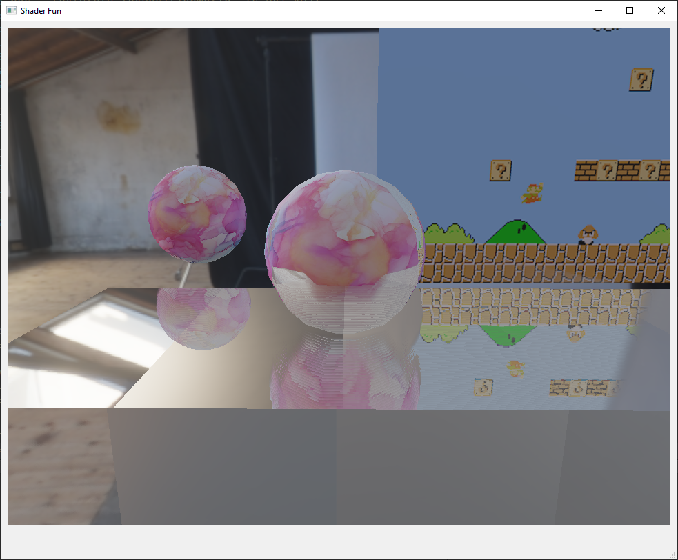
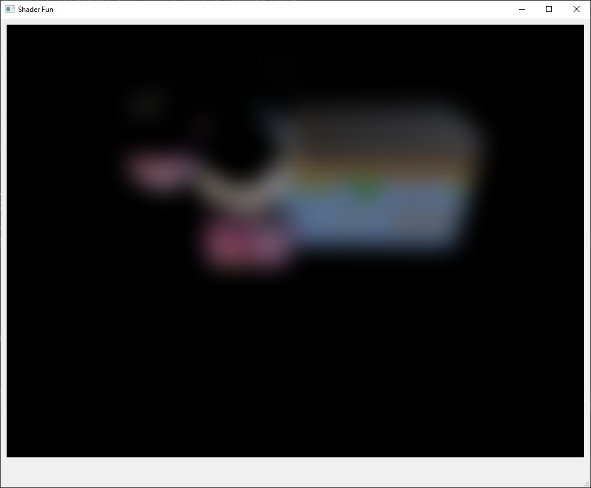
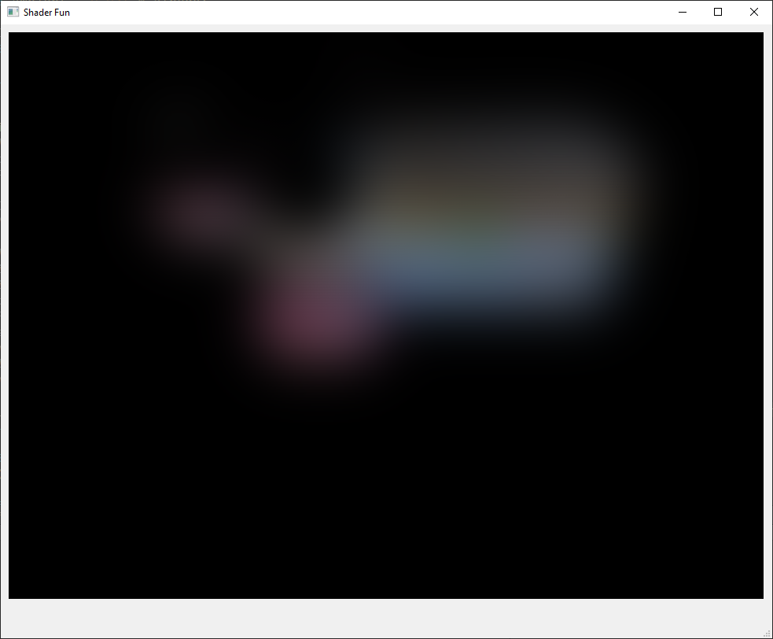
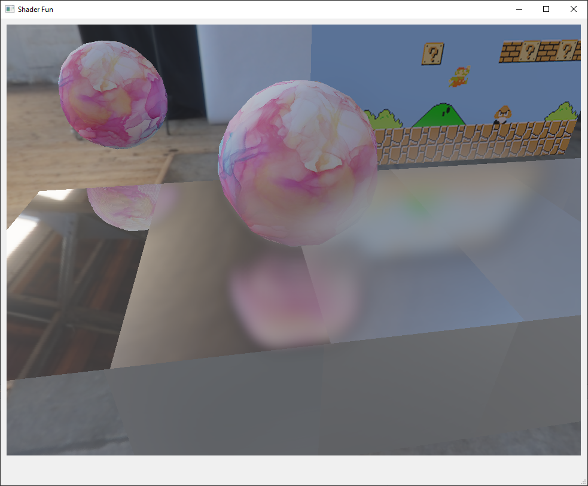
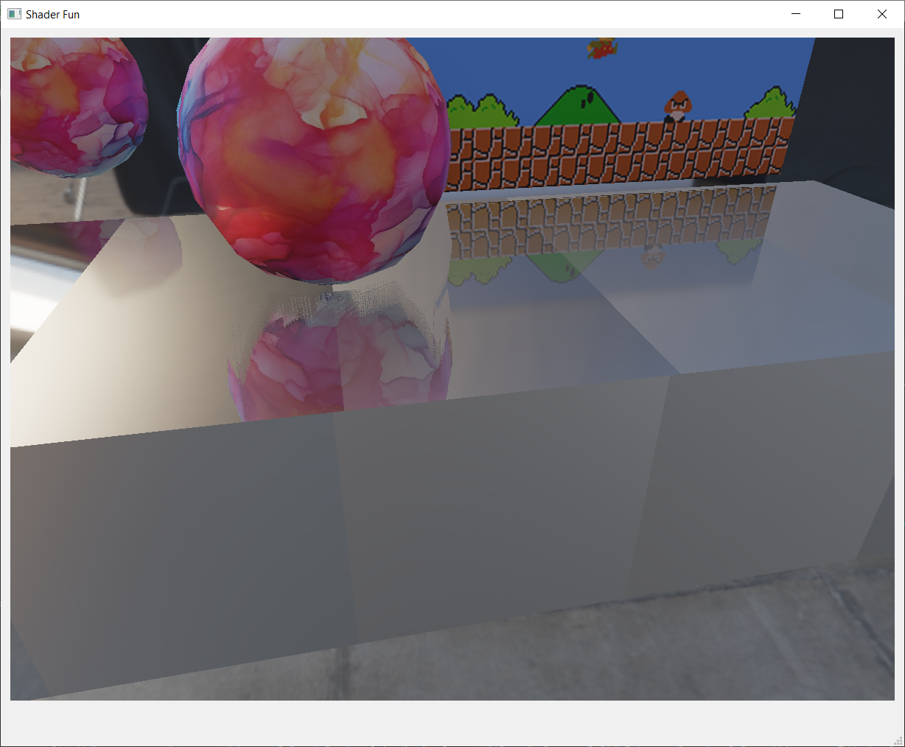
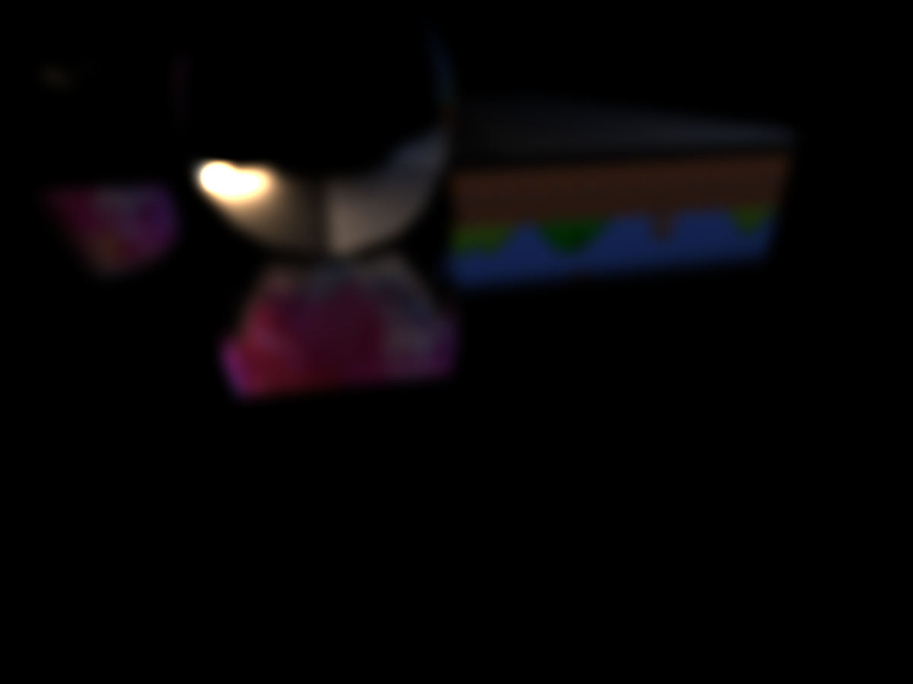
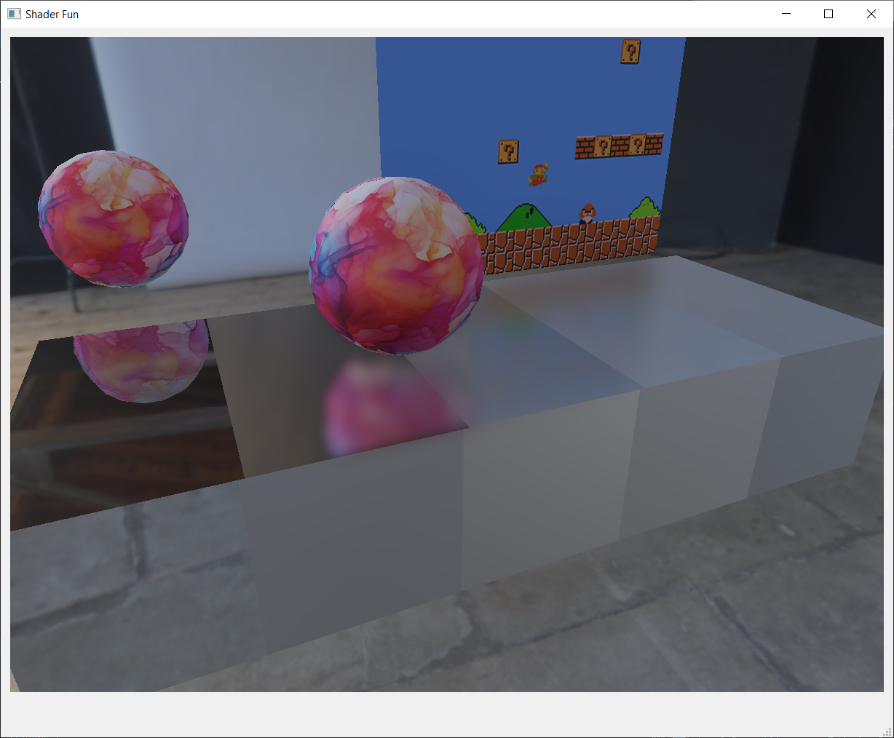

Deferred Rendering and Screen-Space Reflection
======================

**University of Pennsylvania, CIS 561: Advanced Computer Graphics, Homework 8**

Submission
------------
Kyle Bauer kbau121

Late day 2/3 used.

Overview
------------
Now that your approximated microfacet BRDF is capable of reflecting
environment maps, you will add functionality to enable it to reflect
other objects. To do this, you will implement a deferred rendering
pipeline and several intermediate shader programs to compute elements
of the final render pass.

Debugging
--------
We highly recommend using NVIDIA Nsight or RenderDoc to preview
the texture outputs of your render passes. After implementing each
shader in this assignment, debug your project and make sure the
output makes sense before moving on to the next one.

[Refer to this document for step-by-step instructions on using Nsight.](https://docs.google.com/document/d/1oKyaog4z1ctjMIsvNv2L3Eu3lOgz860A_PQdfIr8goA/edit)

Updating this README (5 points)
-------------
Make sure that you fill out this `README.md` file with your name and PennKey,
along with screenshots of your results.

Implementing `MyGL::renderSceneToGBuffer` (10 points)
------------
Follow the instructions in the comments of this function to set up
MyGL to render your 3D geometry's surface attributes to the geometry buffer. Refer to functions like `intermediateScreenSpaceReflToGBuffer` to see examples of how to use some of the classes and functions we have provided you. If you do not implement this function, you will be unable to render anything.

Implementing `g-buffer.frag.glsl` (5 points)
------------------
Fill out the body of `main()` in this shader to store the appropriate
data in each of the five output channels. The PBR (physically-based
  render) channel is optional; you can pre-compute the scene's
  reflection of the environment map in this shader, or in the
  final combination shader. This information is necessary in order
  to correctly render the reflections of objects on other objects
  in the scene.

Computing screen-space reflection (40 points)
----------
Fill in the `main()` function of `screenSpaceReflection.frag.glsl`
to determine where in the G-buffer reflected rays intersect. This
shader should output one of two pieces of data: the reflected color & visibility of another object in the scene, or the UV coordinates & visibility of the point in the G-buffer that is reflected. If you chose to write to the PBR channel in `g-buffer.frag`, then you have all the info you need to write the actual reflected color. If not, then you'll
need to output UV coords and read them in the final combination shader.

If you output the actual reflection, then when you debug your program the output of this shader should look something like this:

This is what the scene looks like with the reflection overlaid on the geometry:

Implementing `MyGL::computeGaussianKernel` (10 points)
--------------
Follow the instructions in the comments of `MyGL::computeGaussianKernel`
to evaluate the Gaussian kernel function with the given kernel radius,
and store it in a 1D array. The code we have provided you takes this
data and buffers it to the GPU as a 2D texture.

You will use this Gaussian kernel to compute blurred reflections to
fake the glossy reflections of rough surfaces.

Blurring the specular reflection (10 points)
------------
Implement `blur.frag.glsl` to apply a Gaussian blur to the texture
read by `u_TextureSSR`. The kernel is represented by the `u_Kernel`
texture's red channel, and the kernel's radius is passed as a uniform.

The code in `MyGL::intermediateBlurSSR` applies this shader five times
to the specular screen-space reflection of your scene in order to make
successively blurrier reflections.

The first level of blur should look like this:

The last level of blur should look like this:

Combining the results together (20 points)
-------
Add code to `combine.frag.glsl` to combine all of your G-buffer
channels together into a final image. Follow the instructions in the comments to properly combine your screen-space reflection colors with the light transport equation code you wrote in the previous assignment.

Your final render should look something like this:

Extra credit (30 points maximum)
-----------
- (30 pts) Rather than implementing glossy reflections by blurring the specular screen-space reflections, instead implement the method used by the Frostbite engine to perform Monte-Carlo estimation of the reflected color in real time. Refer to the lecture recording and notes for more details.
- (15 pts) Leverage the G-buffer to apply fake depth of field to your scene. Define a focal length and progressively blur your scene based on its distance from the focal plane.
- (15 pts) Alter the Gaussian kernel generation code and the blur shader to more efficiently blur your reflections. Use the method discussed in the Linear Sampling section of [this article](https://www.rastergrid.com/blog/2010/09/efficient-gaussian-blur-with-linear-sampling/).

Submitting your project
--------------
Along with your project code, make sure that you fill out this `README.md` file
with your name and PennKey, along with your test renders.

Rather than uploading a zip file to Canvas, you will simply submit a link to
the committed version of your code you wish us to grade. If you click on the
__Commits__ tab of your repository on Github, you will be brought to a list of
commits you've made. Simply click on the one you wish for us to grade, then copy
and paste the URL of the page into the Canvas submission form.
