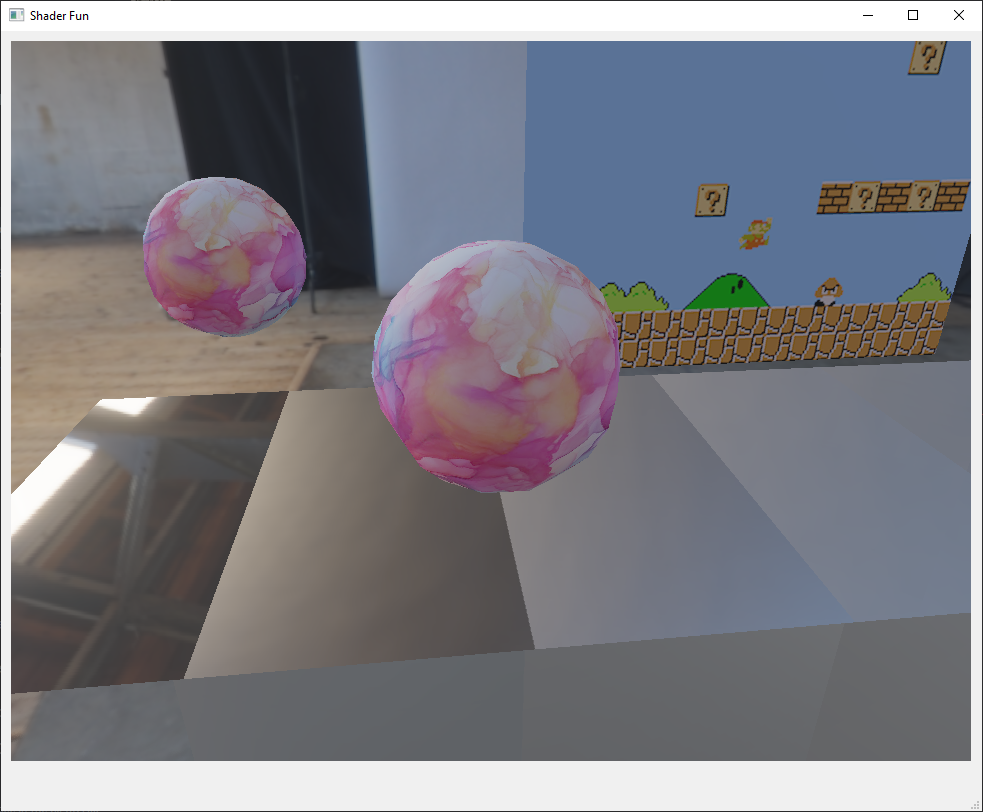
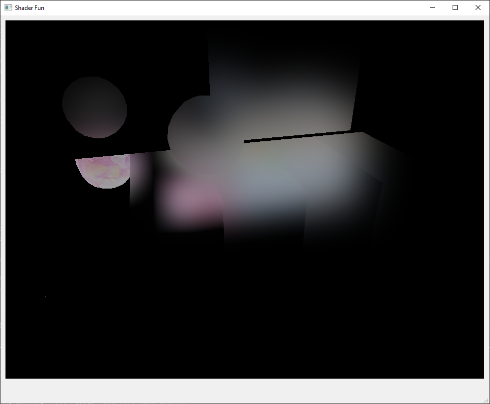
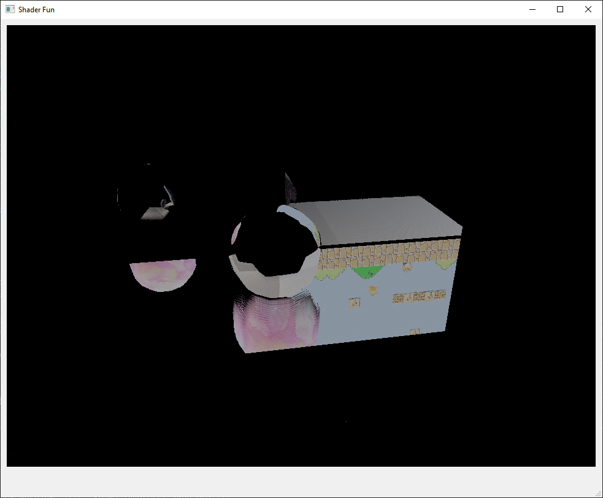

Deferred Rendering and Screen-Space Reflection
======================

  

This implementation of a physically based shader utilizes deferred rendering to complete the image in multiple passes. Pass order is as follows:
1. Environment Map generation
2. Geometry Buffer generation
3. Screen Space Reflection pass
4. Screen Space Reflection Blur (rough surface reflections)
5. Combination to final image

This allows us to create rough surface reflections in real-time.

| Without SSR  | With SSR |
| ------------- | ------------- |
|   |   |

Intermediate Results
----------------------

<table>
  <tr>
    <th>Blur Combined</th>
    <td></td>
  </tr>
  <tr>
    <th>Blur Level 0</th>
    <td></td>
  </tr>
  <tr>
    <th>Blur Level 1</th>
    <td></td>
  </tr>
  <tr>
    <th>Blur Level 4</th>
    <td></td>
  </tr>
</table>
